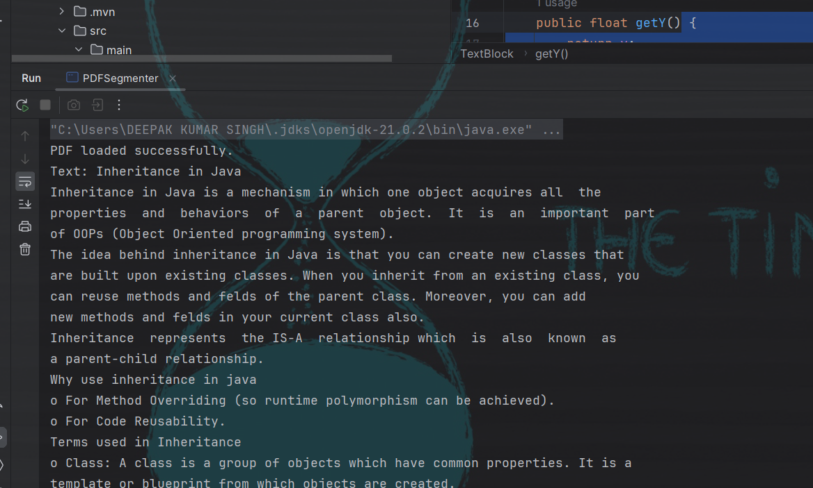

<h1 align="center">PDF Content Segmenter</h1>


## Overview
This Java application segments a system-generated PDF into distinct sections based on whitespace between blocks of text. It identifies logical sections such as headings and paragraphs without using image processing techniques.

## Technologies Used
- Java 8 or above
- Apache PDFBox
- maven

## Setup Instructions
 by maven pom.xml for add Dependencies

###

### Dependencies
---
	 <groupId>org.apache.pdfbox</groupId>
			<artifactId>pdfbox</artifactId>
			<version>2.0.27</version>
		</dependency>

---

  ### Navigate to the Project Directory

  cd  "C:\\Users\\DEEPAK KUMAR SINGH\\OneDrive\\Desktop\\PDFSEGEMENT\\PDFSegmenter\\PDFSegmenter\\Inheritance and its Types.pdf"


## input  section
    segmenter.processPDF("C:\\Users\\DEEPAK KUMAR SINGH\\OneDrive\\Desktop\\PDFSEGEMENT\\PDFSegmenter\\PDFSegmenter\\Inheritance and its Types.pdf");


## output  section




## How to Run the Application

1. **Open Your IDE**
   Open your favorite Java IDE (e.g., IntelliJ IDEA, Eclipse).

2. **Import the Project**
   Import the cloned project into your IDE.

3. **Update the PDF File Path**
   In the `PDFSegmenter.java` class, you can specify the path to the PDF file directly in the `processPDF` method. Ensure you set the path correctly:
   ```java
   PDFSegmenter segmenter = new PDFSegmenter();
   segmenter.processPDF("C:\\Users\\DEEPAK KUMAR SINGH\\OneDrive\\Desktop\\PDFSEGEMENT\\PDFSegmenter\\PDFSegmenter\\Inheritance and its Types.pdf");


## Examples of Usage
Input PDF: Inheritance and its Types.pdf
Output: The application will generate multiple PDF files named  segmenter.processPDF.pdf,each containing one segment based on the whitespace detected in the original PDF

### Licence:- 
- This project is licensed under the MIT License.


<!-- Contact -->
## Summary
PDF Content Segmenter is a Java application that segments PDFs based on whitespace to identify headings and paragraphs. It uses Apache PDFBox for manipulation and outputs multiple segmented PDF files. To run, clone the repository, add dependencies, and specify the PDF file path in the code. Compile and execute the PDFSegmenter class to process the PDF.
                 
                      Maild Id :      deepak76311@gmail.com

<h3 align = "center"> 